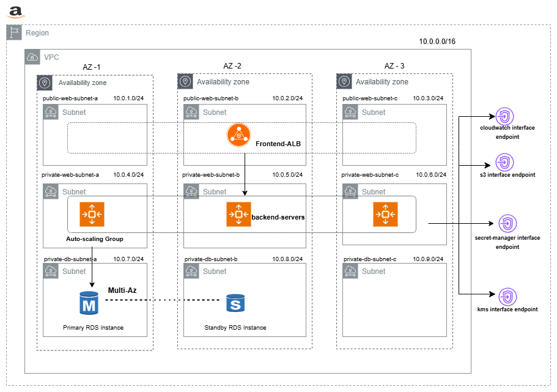

# Hello World Two-Tier Application

This repository contains a simple "Hello World" web application built using a two-tier architecture. It serves as an introductory example to understand basic web architecture and secure communication between components.

## Architecture Overview

The application is divided into two main tiers:

### 1. Frontend Tier
- Built using **HTML**, **CSS**, and **JavaScript** for the user interface.
- **PHP** is used for application logic to:
  - Fetch data from the database.
  - Send messages to the database.
- Handles all communication with the backend using HTTP requests.

### 2. Database Tier
- Stores and manages application data.
- Performs read and write operations as requested by the frontend.
- Configured to accept connections over **SSL/TLS**, ensuring **in-flight encryption** for all data exchanged between the frontend and the database.

## Security Features

- ✅ **SSL/TLS Encrypted Database Connection**: All database traffic is secured with SSL/TLS to protect data during transmission.

## Use Case

This project is ideal for:
- Demonstrating separation of frontend and backend responsibilities.
- Learning to connect PHP-based frontend logic with a secure database.
- Practicing best practices for securing data in web applications.

## Technologies Used

- **Frontend**: HTML, CSS, JavaScript
- **Backend Logic**: PHP
- **Database**: (e.g., MySQL, PostgreSQL) – with SSL/TLS enabled

## 🔧 Part 1: Infrastructure Setup

### 🔹 VPC Configuration
- **Custom VPC**: `10.0.0.0/16`
- **Subnets**:
  - 3 **Public Subnets** (for ELB) across different AZs
  - 3 **Private Subnets** (for EC2 web/app layer)
  - 3 **Private Subnets** (for RDS Multi-AZ)

### 🔹 Routing & NACLs
- **Public Route Table**: Internet-bound traffic via **Internet Gateway**
- **Private Route Table**: Internet access via **NAT Gateway**
- **NACLs**: Configured for subnet-level access control

---

## 🖥️ Part 2: EC2 & RDS Deployment

### 🔹 EC2 (Frontend & App Layer)
- **Custom AMI** with pre-installed packages
- **Launch Template** with:
  - User Data script for configuration
  - IAM role, security group
- **Security Group**:
  - HTTP/HTTPS from ELB
  - SSH via SSM (optional port 22)

### 🔹 RDS (Backend)
- **Engine**: MySQL/PostgreSQL
- **Deployment**: Multi-AZ
- **Encryption**: At-rest with KMS
- **Security Group**: Access only from EC2 private subnets

---

## 🔐 Part 3: Security Implementation

### 🔹 IAM Roles & Policies
- **EC2 IAM Role** with access to:
  - Secrets Manager
  - SSM
  - CloudWatch Logs
- Principle of **least privilege** applied

### 🔹 Secrets Manager
- DB credentials securely stored and accessed in app
- Used in `connection.php` or environment files

### 🔹 Encryption
- **Data at Rest**: RDS + Secrets Manager
- **Data in Transit**: SSL/TLS enforced on DB and ELB

---

## 📈 Part 4: Scalability & High Availability

### 🔹 Auto Scaling
- **ASG** with:
  - Custom AMI
  - Private subnets across 3 AZs
  - Dynamic policies based on CPU/load

### 🔹 Load Balancer
- **ALB** in public subnets
- Health checks on `/health`
- Routes to EC2s in private subnets

---

## 🛡️ Part 5: Backup & Recovery

### 🔹 RDS Backup
- **Automated Backups**: Enabled with 7-day retention
- **Manual Snapshots**: Taken for point-in-time recovery
- Recovery tested in staging environment

---

## 📊 Part 6: Monitoring & Logging

### 🔹 CloudWatch
- **EC2**: CloudWatch Agent + custom metrics
- **RDS**: Enhanced monitoring enabled
- **Alarms**: CPU, memory, storage, connection count

### 🔹 Centralized Logging
- EC2 logs → CloudWatch Logs
- RDS slow logs + error logs
- Optional archival to S3

---

## 📘 Part 7: Best Practices Followed

### 🧠 Best Practices Followed

| Component        | Best Practice Description                                   |
|------------------|-------------------------------------------------------------|
| VPC              | Public/private subnet segregation                           |
| IAM              | Least privilege & no hardcoded credentials                  |
| Secrets          | Stored in Secrets Manager                                   |
| Encryption       | Enabled for at-rest and in-transit                          |
| Monitoring       | CloudWatch with custom metrics and alerts                   |
| Logging          | Forwarded to CloudWatch Logs                                |
| Auto Scaling     | ASG with Launch Template and scaling policy                 |
| High Availability| Multi-AZ for both EC2 and RDS                               |
| Backup           | Automated backups + manual snapshots                        |
| SSM              | Enabled for secure and auditable access                     |

---